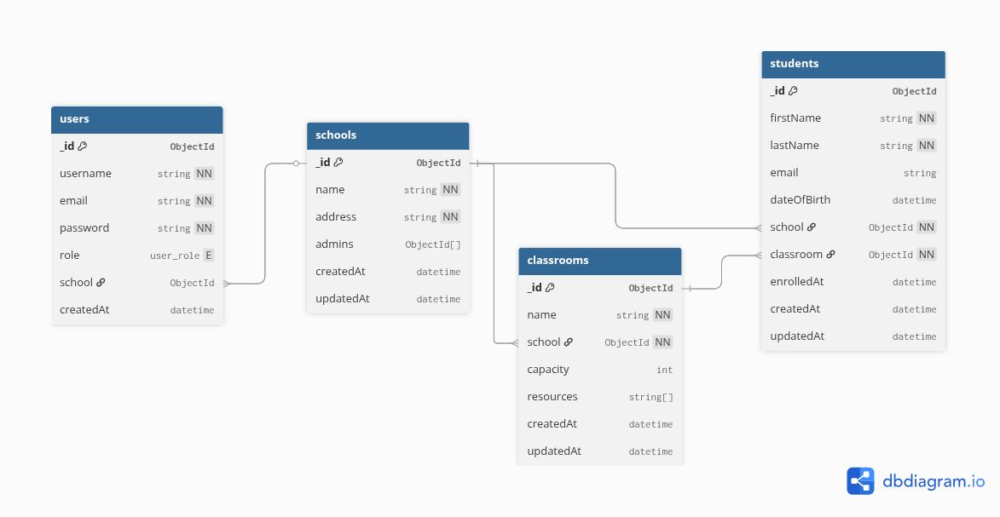
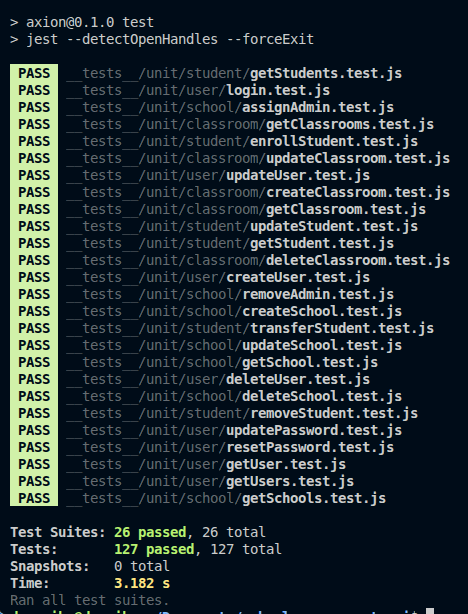

# School Management System API

A RESTful API for managing schools, classrooms, and students, built on the [Axion](https://github.com/qantra-io/axion) microservice template. The system implements role-based access control (RBAC) with JWT authentication, allowing superadmins to manage schools and school administrators to manage classrooms and students within their assigned institutions.

---

## Table of Contents

- [Features](#features)
- [Tech Stack](#tech-stack)
- [Architecture](#architecture)
- [Getting Started](#getting-started)
  - [Prerequisites](#prerequisites)
  - [Installation](#installation)
  - [Environment Variables](#environment-variables)
  - [Running the Server](#running-the-server)
  - [Seeding the First Superadmin](#seeding-the-first-superadmin)
  - [Swagger Documentation](#swagger-documentation)
- [API Documentation](#api-documentation)
  - [Utility](#utility)
  - [User Management](#user-management)
  - [Schools](#schools)
  - [Classrooms](#classrooms)
  - [Students](#students)
- [Authentication Flow](#authentication-flow)
- [Role-Based Access Control](#role-based-access-control)
- [Database Schema](#database-schema)
- [Project Structure](#project-structure)
- [Error Handling](#error-handling)
- [Testing](#testing)
- [Docker](#docker)
- [Contributing](#contributing)
- [License](#license)

---

## Features

- JWT-based authentication with long-lived tokens
- Role-based access control (Superadmin and School Administrator)
- Full CRUD operations for schools, classrooms, and students
- Student enrollment and transfer between classrooms
- Schema-based input validation on all endpoints
- Redis caching layer for performance
- Swagger/OpenAPI interactive documentation
- Centralized error handling with consistent response formats
- API rate limiting and security headers via Helmet

---

## Tech Stack

| Component | Technology |
|---|---|
| Runtime | Node.js |
| Framework | Express.js (via Axion template) |
| Database | MongoDB with Mongoose ODM |
| Cache | Redis |
| Authentication | JSON Web Tokens (JWT) + bcrypt |
| Validation | qantra-pineapple |
| Inter-service Communication | ion-cortex (Redis-based) |
| API Documentation | Swagger UI (swagger-jsdoc + swagger-ui-express) |

---

## Architecture

This project is built on the **Axion** template, a microservice-oriented Node.js boilerplate by Qantra.io. Key architectural decisions include:

**Dynamic API Routing** — Instead of defining individual route files, a single catch-all route (`/api/:moduleName/:fnName`) dynamically resolves requests to the correct manager and function. Endpoints are declared within each manager's `httpExposed` array.

**Manager Pattern** — Business logic is encapsulated in manager classes that combine what would traditionally be separate controller and service layers. Each entity (User, School, Classroom, Student) has its own manager.

**Middleware Injection** — Authentication and authorization middleware are triggered automatically based on function parameter naming conventions. Parameters prefixed with `__` (e.g., `__token`, `__superadmin`) trigger the corresponding middleware before the business logic executes.

**Auto-Discovery** — Mongoose models (`*.mongoModel.js`), validation schemas (`*.schema.js`), and middleware files (`*.mw.js`) are automatically discovered and loaded at boot time via glob patterns.

For a deeper technical reference on the architecture, see [CLAUDE.md](./CLAUDE.md).

---

## Getting Started

### Prerequisites

- **Node.js** >= 16.x
- **MongoDB** — Local instance or [MongoDB Atlas](https://www.mongodb.com/atlas) cloud database
- **Redis** — Local instance or cloud-hosted Redis
- **npm**

### Installation

```bash
# Clone the repository
git clone https://github.com/your-username/school-management-api.git
cd school-management-api

# Install dependencies
npm install

# Copy the example environment file
cp .env.example .env
```

### Environment Variables

Edit the `.env` file you just created:

```env
# Server
USER_PORT=3000
SERVICE_NAME=school_management

# MongoDB
MONGO_URI=mongodb://localhost:27017/school_management

# Redis Cache
CACHE_PREFIX=school_cache
CACHE_REDIS=redis://localhost:6379

# Cortex (inter-service communication)
CORTEX_PREFIX=school
CORTEX_REDIS=redis://localhost:6379
CORTEX_TYPE=school_service

# Authentication — use long random strings in production
LONG_TOKEN_SECRET=your_long_token_secret_here
SHORT_TOKEN_SECRET=your_short_token_secret_here
NACL_SECRET=your_nacl_secret_here
```

### Running the Server

```bash
# Production mode
npm start

# Development mode (auto-reload with nodemon)
npm run dev
```

You should see:

```
Mongoose default connection open to mongodb://localhost:27017/school_management
SCHOOL_MANAGEMENT is running on port: 3000
```

### Seeding the First Superadmin

The system has no open registration endpoint. The very first superadmin account must be created using the seed script before the API can be used.

```bash
# Minimum — only password is required
SEED_PASSWORD=yourpassword node scripts/seed.js

# With custom username and email
SEED_USERNAME=admin SEED_EMAIL=admin@school.com SEED_PASSWORD=yourpassword node scripts/seed.js
```

The script reads `MONGO_URI` from your `.env` file automatically. It is **idempotent** — if a superadmin already exists it exits without making any changes, so it is safe to re-run.

Default values if not overridden:
- `SEED_USERNAME`: `superadmin`
- `SEED_EMAIL`: `admin@school.com`

Once the seed runs successfully, log in via `POST /api/user/login` to get your JWT token. From there you can create additional users through the API.

### Swagger Documentation

Once the server is running, access the interactive API docs at:

```
http://localhost:3000/api-docs
```

Click **Authorize** and enter the JWT token from `POST /api/user/login` to authenticate all requests directly from the browser.

---

## API Documentation

All endpoints follow the pattern: `{METHOD} /api/{module}/{function}`

The API returns consistent JSON responses:

```json
// Success
{ "ok": true, "data": { ... } }

// Error
{ "ok": false, "message": "Error description" }

// Validation Error
{ "ok": false, "errors": [ ... ] }
```

### Utility

| Method | Endpoint | Auth | Description |
|---|---|---|---|
| GET | `/api/status/health` | None | Health check — confirms the server is running |

### User Management

| Method | Endpoint | Auth | Description |
|---|---|---|---|
| POST | `/api/user/login` | None | Login and receive a JWT token |
| POST | `/api/user/createUser` | Token + Superadmin | Create a new user (any role) |
| GET | `/api/user/getUsers` | Token + Superadmin | List all users |
| GET | `/api/user/getUser` | Token + Superadmin | Get a single user by ID |
| PUT | `/api/user/updateUser` | Token + Superadmin | Update user details |
| DELETE | `/api/user/deleteUser` | Token + Superadmin | Delete a user account |

**Login**

```bash
curl -X POST http://localhost:3000/api/user/login \
  -H "Content-Type: application/json" \
  -d '{
    "email": "admin@school.com",
    "password": "yourpassword"
  }'
```

Response:

```json
{
  "ok": true,
  "data": {
    "user": { "username": "superadmin", "email": "admin@school.com", "role": "superadmin" },
    "longToken": "eyJhbGciOiJIUzI1NiIs..."
  }
}
```

**Create User** (superadmin only)

```bash
curl -X POST http://localhost:3000/api/user/createUser \
  -H "Content-Type: application/json" \
  -H "Authorization: Bearer <your_token>" \
  -d '{
    "username": "schooladmin1",
    "email": "schooladmin1@school.com",
    "password": "securePassword123",
    "role": "school_admin"
  }'
```

### Schools

Requires **superadmin** role except where noted.

| Method | Endpoint | Auth | Description |
|---|---|---|---|
| POST | `/api/school/createSchool` | Token + Superadmin | Create a new school |
| GET | `/api/school/getSchool` | Token | Get a school by ID |
| GET | `/api/school/getSchools` | Token + Superadmin | List all schools |
| PUT | `/api/school/updateSchool` | Token + Superadmin | Update a school |
| DELETE | `/api/school/deleteSchool` | Token + Superadmin | Delete a school (cascades to classrooms and students) |
| POST | `/api/school/assignAdmin` | Token + Superadmin | Assign a school_admin user to a school |
| DELETE | `/api/school/removeAdmin` | Token + Superadmin | Remove an admin from a school (user account is kept) |

**Create School**

```bash
curl -X POST http://localhost:3000/api/school/createSchool \
  -H "Content-Type: application/json" \
  -H "Authorization: Bearer <your_token>" \
  -d '{
    "name": "Springfield Elementary",
    "address": "123 Education Ave, Springfield"
  }'
```

**Assign Admin**

```bash
curl -X POST http://localhost:3000/api/school/assignAdmin \
  -H "Content-Type: application/json" \
  -H "Authorization: Bearer <your_token>" \
  -d '{
    "schoolId": "64a1b2c3d4e5f6a7b8c9d0e1",
    "userId": "64a1b2c3d4e5f6a7b8c9d0e2"
  }'
```

### Classrooms

Requires **school_admin** role. Admins can only manage classrooms within their assigned school.

| Method | Endpoint | Auth | Description |
|---|---|---|---|
| POST | `/api/classroom/createClassroom` | Token + School Admin | Create a classroom |
| GET | `/api/classroom/getClassrooms` | Token + School Admin | List classrooms in admin's school |
| GET | `/api/classroom/getClassroom` | Token | Get a classroom by ID |
| PUT | `/api/classroom/updateClassroom` | Token + School Admin | Update a classroom |
| DELETE | `/api/classroom/deleteClassroom` | Token + School Admin | Delete a classroom (blocked if students are enrolled) |

**Create Classroom**

The classroom is automatically scoped to the school from the admin's JWT token — no `schoolId` needed in the body.

```bash
curl -X POST http://localhost:3000/api/classroom/createClassroom \
  -H "Content-Type: application/json" \
  -H "Authorization: Bearer <your_token>" \
  -d '{
    "name": "Grade 5 - Section A",
    "capacity": 30,
    "resources": ["projector", "whiteboard", "computers"]
  }'
```

### Students

Requires **school_admin** role. Admins can only manage students within their assigned school.

| Method | Endpoint | Auth | Description |
|---|---|---|---|
| POST | `/api/student/enrollStudent` | Token + School Admin | Enroll a new student |
| GET | `/api/student/getStudents` | Token + School Admin | List students in admin's school |
| GET | `/api/student/getStudent` | Token | Get a student by ID |
| PUT | `/api/student/updateStudent` | Token + School Admin | Update student profile |
| PUT | `/api/student/transferStudent` | Token + School Admin | Transfer student to a different classroom |
| DELETE | `/api/student/removeStudent` | Token + School Admin | Remove a student |

**Enroll Student**

```bash
curl -X POST http://localhost:3000/api/student/enrollStudent \
  -H "Content-Type: application/json" \
  -H "Authorization: Bearer <your_token>" \
  -d '{
    "firstName": "John",
    "lastName": "Doe",
    "email": "john.doe@student.com",
    "dateOfBirth": "2010-05-15",
    "classroomId": "64a1b2c3d4e5f6a7b8c9d0e2"
  }'
```

**Transfer Student**

```bash
curl -X PUT http://localhost:3000/api/student/transferStudent \
  -H "Content-Type: application/json" \
  -H "Authorization: Bearer <your_token>" \
  -d '{
    "id": "64a1b2c3d4e5f6a7b8c9d0e3",
    "classroomId": "64a1b2c3d4e5f6a7b8c9d0e4"
  }'
```

---

## Authentication Flow

```
0. Bootstrap     →  SEED_PASSWORD=secret node scripts/seed.js
                     (creates first superadmin — one-time setup)
                          ↓
1. Login         →  POST /api/user/login
                          ↓
2. Server returns ←  JWT token (longToken)
                          ↓
3. Client sends  →  Authorization: Bearer <token>
   token on all      in every subsequent request
   requests
                          ↓
4. Middleware     →  __token  verifies JWT signature
   chain runs        __superadmin / __schoolAdmin checks role
                          ↓
5. Business logic →  Manager function executes with injected auth data
```

---

## Role-Based Access Control

The system implements two roles with distinct permission scopes:

### Superadmin

- Full system-wide access
- Create, read, update, and delete schools
- Assign and remove school administrators
- Create users of any role
- View all data across the platform

### School Administrator

- Access restricted to their assigned school only
- Create, read, update, and delete classrooms within their school
- Enroll, update, transfer, and remove students within their school
- Cannot access or modify resources belonging to other schools

Role enforcement happens at the middleware level. The `__superadmin` and `__schoolAdmin` middleware verify the user's role from the decoded JWT token before the request reaches business logic.

---

## Database Schema

### User

| Field | Type | Constraints |
|---|---|---|
| username | String | Required, unique |
| email | String | Required, unique |
| password | String | Required, hashed with bcrypt |
| role | String | Enum: `superadmin`, `school_admin` |
| school | ObjectId | Ref: School (required for school_admin) |
| createdAt | Date | Auto-generated |

### School

| Field | Type | Constraints |
|---|---|---|
| name | String | Required |
| address | String | Required |
| admins | [ObjectId] | Ref: User (array of assigned admins) |
| createdAt | Date | Auto-generated |
| updatedAt | Date | Auto-updated |

### Classroom

| Field | Type | Constraints |
|---|---|---|
| name | String | Required |
| school | ObjectId | Ref: School, required |
| capacity | Number | Optional, must be a positive integer |
| resources | [String] | Optional |
| createdAt | Date | Auto-generated |
| updatedAt | Date | Auto-updated |

### Student

| Field | Type | Constraints |
|---|---|---|
| firstName | String | Required |
| lastName | String | Required |
| email | String | Unique, optional |
| dateOfBirth | Date | Optional |
| school | ObjectId | Ref: School, required (denormalized for fast queries) |
| classroom | ObjectId | Ref: Classroom, required |
| enrolledAt | Date | Auto-generated |
| createdAt | Date | Auto-generated |
| updatedAt | Date | Auto-updated |

### Entity Relationship Diagram


```

### Cascade Rules

| Event | Action |
|---|---|
| Delete School | Deletes all classrooms and students; sets `User.school = null` for assigned admins |
| Delete Classroom | Blocked if students are enrolled — remove or transfer them first |
| Delete User (school_admin) | Removed from `School.admins[]`; `User.school` set to null |
| Remove admin from school | Removed from `School.admins[]`; user account is kept |
| Transfer Student | Updates `Student.classroom` only — school stays the same |

---

## Project Structure

```
school-management-api/
├── app.js                              # Application entry point
├── CLAUDE.md                           # Technical architecture reference
├── package.json
├── .env.example                        # Environment variable template
├── Dockerfile                          # Multi-stage Docker image (dev + prod)
├── docker-compose.yml                  # Compose file with dev and prod profiles
│
├── config/
│   ├── index.config.js                 # Central configuration (dotenv)
│   └── swagger.js                      # Swagger/OpenAPI definition
│
├── connect/
│   └── mongo.js                        # MongoDB connection handler
│
├── cache/
│   └── cache.dbh.js                    # Redis cache handler
│
├── scripts/
│   └── seed.js                         # Superadmin seed script
│
├── loaders/
│   ├── ManagersLoader.js               # Central dependency injection and wiring
│   ├── MiddlewaresLoader.js            # Auto-loads middleware files
│   ├── ValidatorsLoader.js             # Auto-loads validation schemas
│   ├── MongoLoader.js                  # Auto-loads Mongoose models
│   └── _common/
│       └── fileLoader.js               # Glob-based file discovery
│
├── managers/
│   ├── api/
│   │   └── Api.manager.js              # Dynamic API routing engine
│   ├── http/
│   │   └── SchoolServer.manager.js     # Express server configuration
│   ├── entities/
│   │   ├── status/
│   │   │   └── AppStatus.manager.js    # Health check endpoint
│   │   ├── user/                       # User entity
│   │   │   ├── User.manager.js
│   │   │   ├── user.schema.js
│   │   │   └── User.mongoModel.js
│   │   ├── school/                     # School entity
│   │   │   ├── School.manager.js
│   │   │   ├── school.schema.js
│   │   │   └── School.mongoModel.js
│   │   ├── classroom/                  # Classroom entity
│   │   │   ├── Classroom.manager.js
│   │   │   ├── classroom.schema.js
│   │   │   └── Classroom.mongoModel.js
│   │   └── student/                    # Student entity
│   │       ├── Student.manager.js
│   │       ├── student.schema.js
│   │       └── Student.mongoModel.js
│   ├── token/
│   │   └── Token.manager.js            # JWT token management
│   ├── response_dispatcher/
│   │   └── ResponseDispatcher.manager.js
│   └── _common/
│       ├── schema.models.js            # Validation model definitions
│       └── schema.validators.js        # Custom validator functions
│
├── mws/                                # Middleware (auto-discovered)
│   ├── __token.mw.js                   # JWT verification
│   ├── __superadmin.mw.js              # Superadmin role enforcement
│   ├── __schoolAdmin.mw.js             # School admin role enforcement
│   └── __device.mw.js                  # Device detection
│
├── libs/
│   └── utils.js                        # Shared utilities
│
├── static_arch/
│   └── main.system.js                  # System architecture config
│
└── __tests__/
    └── unit/
        ├── user/                       # User manager unit tests (38 tests)
        │   ├── helpers.js
        │   ├── login.test.js
        │   ├── createUser.test.js
        │   ├── getUser.test.js
        │   ├── getUsers.test.js
        │   ├── updateUser.test.js
        │   ├── updatePassword.test.js
        │   ├── resetPassword.test.js
        │   └── deleteUser.test.js
        ├── school/                     # School manager unit tests (31 tests)
        │   ├── helpers.js
        │   ├── createSchool.test.js
        │   ├── getSchool.test.js
        │   ├── getSchools.test.js
        │   ├── updateSchool.test.js
        │   ├── deleteSchool.test.js
        │   ├── assignAdmin.test.js
        │   └── removeAdmin.test.js
        ├── classroom/                  # Classroom manager unit tests (25 tests)
        │   ├── helpers.js
        │   ├── createClassroom.test.js
        │   ├── getClassroom.test.js
        │   ├── getClassrooms.test.js
        │   ├── updateClassroom.test.js
        │   └── deleteClassroom.test.js
        └── student/                    # Student manager unit tests (33 tests)
            ├── helpers.js
            ├── enrollStudent.test.js
            ├── getStudent.test.js
            ├── getStudents.test.js
            ├── updateStudent.test.js
            ├── transferStudent.test.js
            └── removeStudent.test.js
```

---

## Error Handling

The API uses a centralized response dispatcher that returns consistent error formats:

**Validation Error**

```json
{
  "ok": false,
  "errors": [
    {
      "label": "School Name",
      "path": "name",
      "message": "School Name is required"
    }
  ]
}
```

**Authentication Error**

```json
{
  "ok": false,
  "message": "Authentication required"
}
```

**Authorization Error**

```json
{
  "ok": false,
  "message": "Insufficient permissions. Superadmin access required."
}
```

**Not Found**

```json
{
  "ok": false,
  "message": "School not found"
}
```

**Rate Limit Exceeded**

Auth endpoints (`/api/user/login`, `/api/user/createUser`) allow 10 requests per 15 minutes. All other API routes allow 100 requests per 15 minutes.

```json
{
  "ok": false,
  "message": "Too many requests, please try again later."
}
```

---

## Testing

```bash
# Run all tests
npm test

# Run a specific entity's tests
npx jest __tests__/unit/school
npx jest __tests__/unit/classroom
npx jest __tests__/unit/student
npx jest __tests__/unit/user

# Watch mode (re-runs on file change)
npm run test:watch

# With coverage report
npm run test:coverage
```

The test suite contains **127 unit tests across 26 test suites**, covering all four entity managers:

| Entity | Tests | Coverage |
|---|---|---|
| User | 38 | login, createUser, getUser, getUsers, updateUser, updatePassword, resetPassword, deleteUser |
| School | 31 | createSchool, getSchool, getSchools, updateSchool, deleteSchool, assignAdmin, removeAdmin |
| Classroom | 25 | createClassroom, getClassroom, getClassrooms, updateClassroom, deleteClassroom |
| Student | 33 | enrollStudent, getStudent, getStudents, updateStudent, transferStudent, removeStudent |

Each test file covers validation short-circuiting, not-found cases, authorization checks, business logic, and successful outcomes — all with fully mocked dependencies (no database required).



---

## Docker

The project ships with a multi-stage `Dockerfile` and a `docker-compose.yml` that uses **profiles** to separate dev and prod environments. Both profiles spin up MongoDB 7 and Redis 7 alongside the application container.

### Development (hot-reload)

Source code is bind-mounted into the container so changes reflect immediately without rebuilding the image. The app runs with `nodemon`.

```bash
# First run (builds image)
docker compose --profile dev up --build

# Subsequent runs
docker compose --profile dev up

# Stop and remove containers
docker compose --profile dev down
```

### Production

Source is copied into the image at build time. Only production dependencies are installed (`--omit=dev`). The app runs with `node app.js`.

```bash
# Build and start
docker compose --profile prod up --build

# Stop and remove containers
docker compose --profile prod down
```

### Seeding Inside Docker

After starting the containers, run the seed script inside the running app container:

```bash
# Development
docker exec school_management_api sh -c "SEED_PASSWORD=yourpassword node scripts/seed.js"

# Production
docker exec school_management_api sh -c "SEED_PASSWORD=yourpassword node scripts/seed.js"
```

### Notes

- The `.env` file is read by the container at startup via `env_file: .env`. The Docker Compose config overrides `MONGO_URI`, `CACHE_REDIS`, and `CORTEX_REDIS` to point to the internal service hostnames (`mongo`, `redis`) — you do not need to change these values in your `.env` for Docker.
- MongoDB data is persisted in a named volume (`mongo_data`) so it survives container restarts.
- Redis data is persisted in a named volume (`redis_data`).

---

## Contributing

1. Fork the repository
2. Create a feature branch (`git checkout -b feature/add-grading-system`)
3. Follow the existing architectural patterns (see [CLAUDE.md](./CLAUDE.md) for details)
4. Write tests for new functionality
5. Commit your changes (`git commit -m 'feat: add grading system'`)
6. Push to the branch (`git push origin feature/add-grading-system`)
7. Open a Pull Request

---

## License

This project is licensed under the ISC License.
